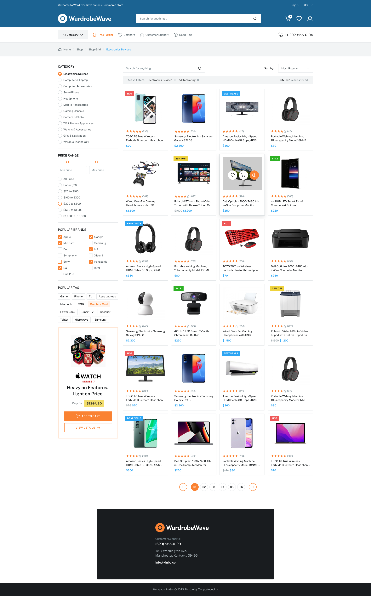
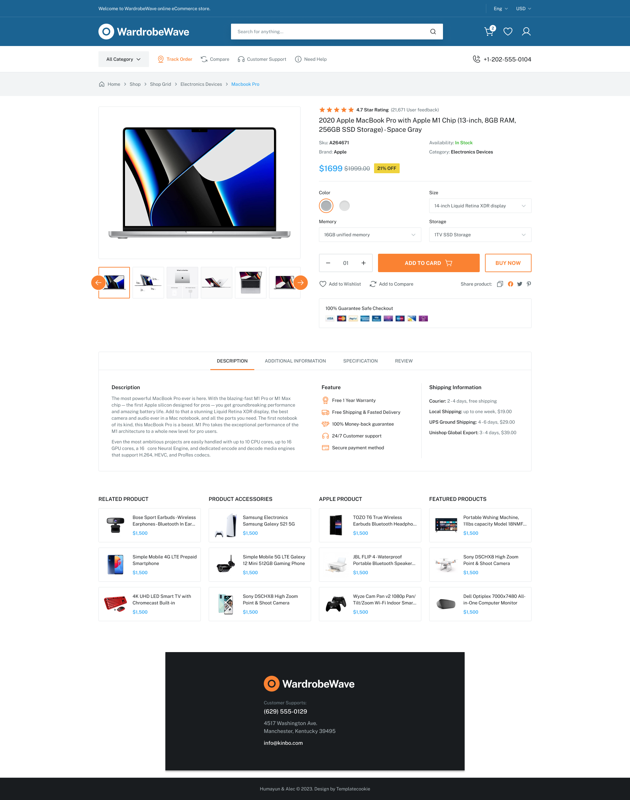
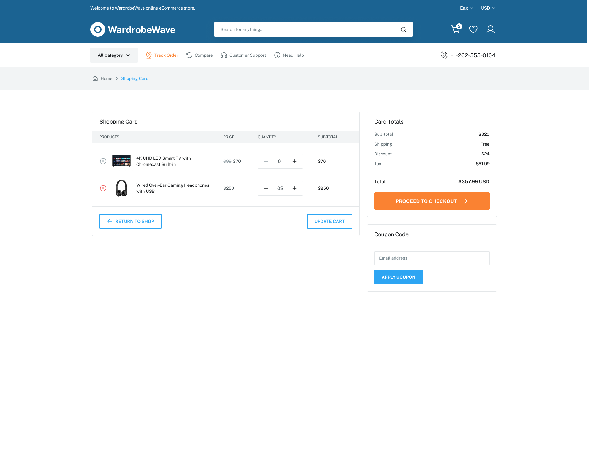
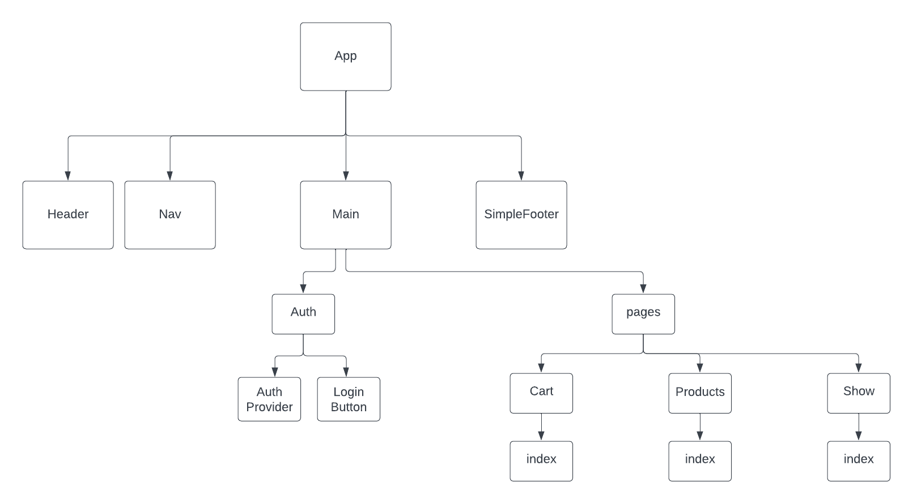
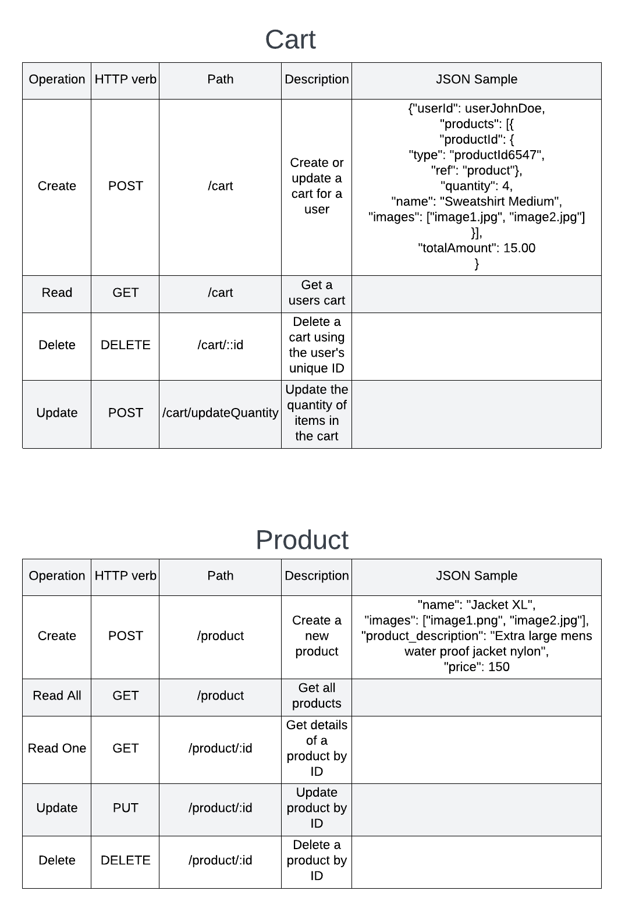

# WardrobeWave
MERN ECommerce App
[trello link](https://trello.com/b/tRr82xws/project-3-planning)
## IceBox

## Current/MVP

## Wireframes
### Product Index

### Product Details

### Cart

### Component Hierarchy Tree

### ERD
 .png)

### CRUD Chart

## Known Issues

* Without any items in cart, when cart icon is clicked, displays "loading..." until items are added in the product page
